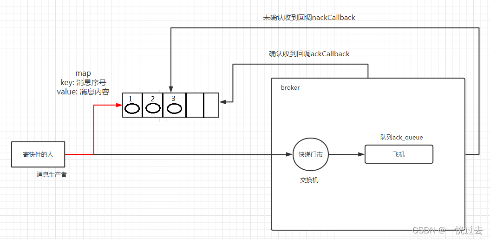
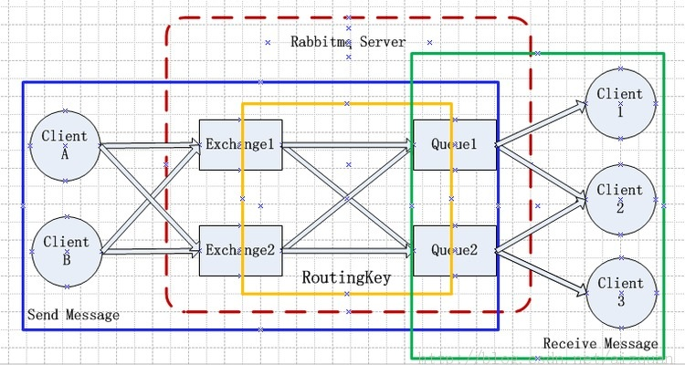
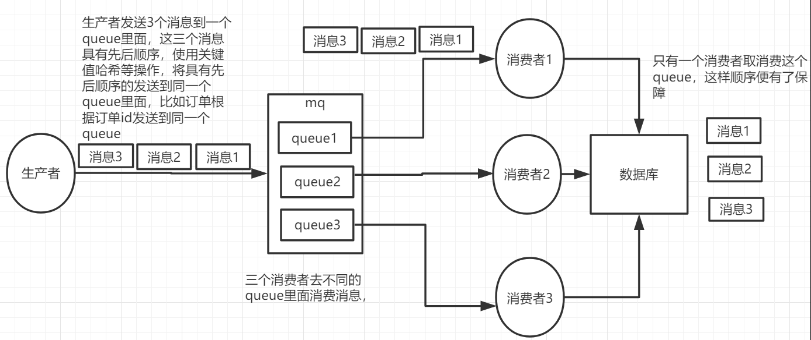
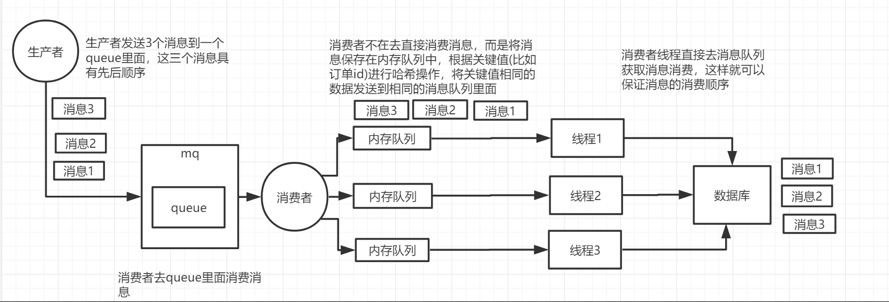

# 建议查看本github下的rabbitmq仓库

## 交换机的说明

在没有交换机的情况，生产者直接往队列发送消息，消费者绑定队列消费相消息，但是同一个队列中一个消息只会被消费一次，所以无法满足一个消息同时被多个消费者使用；

​交换机的作用就可以解决这个问题，一个交换机可以绑定多个不同的队列，一个队列绑定多个消费者；生产者将消息发送到交换机中，所有绑定了该交换机的队列都可以收到消息；所以生产者发送一次消息，可以被不同的队列**(消费者)**
进行消费；当同一个队列中存在多个消费者时，消息不会被重复消费；

## 发布确认模式

概念： 生产者将信道设置成 确认(confirm) 模式，一旦信道进入 confirm 模式，所有在该信道上面发布的消息都将会被指派一个唯一的 ID(从 1 开始)，一旦消息被投递到所有匹配的队列之后，broker就会发送一个确认给生产者(
包含消息的唯一 ID)，这就使得生产者知道消息已经正确到达目的队列了，如果消息和队列是可持久化的，那么确认消息会在将消息写入磁盘之后发出，broker 回传给生产者的确认消息中 delivery-tag 域包含了确认消息的序列号。

优点： confirm 模式最大的好处在于他是异步的，一旦发布一条消息，生产者就可以在等待信道返回确认的同时继续发送下一条消息，当消息最终得到ack之后，生产者可以通过回调方法来处理该ack消息；如果 RabbitMQ
因为自身内部错误导致消息丢失，就会发送一条 nack 消息，生产者应用程序同样可以在回调方法中处理该 nack 消息；

使用： 发布确认模式默认是没有开启的，生产者通过调用方法 confirmSelect实现开启。

```java
Channel channel=connection.createChannel();
        channel.confirmSelect();
```

### 消费者的实现

```java
public class Consumer {

    //设置队列名称
    private final static String QUEUE_NAME = "confirm_queue";

    public static void main(String[] args) throws Exception {
        // 获取Channel
        Channel channel = RabbitMqUtils.getChannel();

        // 消费队列消息的一个回调接口
        DeliverCallback deliverCallback = (consumerTag, delivery) -> {
            String message = new String(delivery.getBody());
            System.out.println("消息消费成功,内容:");
            System.out.println(message);
        };
        // 取消消费的一个回调接口   如在消费的时候队列被删除掉了
        CancelCallback cancelCallback = (consumerTag) -> {
            System.out.println("消息消费被中断");
        };

        // 消费者消费消息
        channel.basicConsume(QUEUE_NAME, true, deliverCallback, cancelCallback);
        System.out.println("等待接收消息....");
    }
}

```

### 单个确认发布（生产者的实现）

单个确认发布： 是一种简单的确认方式，它是一种**同步确认发布** 的方式，也就是发布的消息只有被确认发布之后，后续的消息才能继续发布,通过waitForConfirmsOrDie(long outTime)方法，指定时间范围内(单位:
毫秒)这个消息没有被确认那么它将抛出异常；通过waitForConfirms()对broker响应的消息进行确认；

这种确认方式有一个最大的缺点就是：发布速度特别的慢，因为如果没有确认发布的消息就会阻塞所有后续消息的发布， 这种方式最多提供每秒不超过数百条发布消息的吞吐量，当然对于某 些应用程序来说这可能已经足够了。

```java
public class SingleProducer {

    // 设置队列名称
    private final static String QUEUE_NAME = "confirm_queue";
    // 发送消息数量
    private final static Integer MESSAGE_COUNT = 100;

    public static void main(String[] args) throws Exception {
        try (Channel channel = RabbitMqUtils.getChannel()) {
            channel.queueDeclare(QUEUE_NAME, false, false, false, null);
            //开启发布确认
            channel.confirmSelect();
            long begin = System.currentTimeMillis();
            for (int i = 0; i < MESSAGE_COUNT; i++) {
                String message = i + "";
                channel.basicPublish("", QUEUE_NAME, null, message.getBytes());
                //服务端返回确认状态，如果 false或超时时间内未返回，生产者可以消息重发
                boolean flag = channel.waitForConfirms();
                if (flag) {
                    System.out.println("消息发送成功");
                }
            }
            long end = System.currentTimeMillis();
            System.out.println("发布" + MESSAGE_COUNT + "个单独确认消息,耗时" + (end - begin) + "ms");
        }
    }
}

```

### 批量确认发布（生产者实现）

批量确认发布： 与单个等待确认消息相比，会先发布一批消息然后一起确认 可以极大地提高吞吐量，它也是一种**同步确认发布** 的方式。

这种方式的缺点就是： 当消息发布出现问题时，不知道是哪个消息出现问题了；

```java
public class BatchProducer {

    // 设置队列名称
    private final static String QUEUE_NAME = "confirm_queue";
    // 发送消息数量
    private final static Integer MESSAGE_COUNT = 100;

    public static void main(String[] args) throws Exception {
        try (Channel channel = RabbitMqUtils.getChannel()) {
            channel.queueDeclare(QUEUE_NAME, false, false, false, null);
            // 开启发布确认
            channel.confirmSelect();
            // 批量确认消息大小
            int batchSize = 100;
            // 未确认消息个数
            int outstandingMessageCount = 0;
            long begin = System.currentTimeMillis();
            for (int i = 0; i < MESSAGE_COUNT; i++) {
                String message = i + "";
                channel.basicPublish("", QUEUE_NAME, null, message.getBytes());
                outstandingMessageCount++;
                // 达到设置的批处理大小时，进行确认
                if (outstandingMessageCount == batchSize) {
                    channel.waitForConfirms();
                    outstandingMessageCount = 0;
                }
            }
            // 为了确保还有剩余没有确认消息，进行再次确认
            if (outstandingMessageCount > 0) {
                channel.waitForConfirms();
            }
            long end = System.currentTimeMillis();
            System.out.println("发布" + MESSAGE_COUNT + "个批量确认消息,耗时" + (end - begin) + "ms");
        }
    }
}

```

### 异步确认发布（生产者实现）

异步确认发布： 虽然编程逻辑比上两个要复杂，但是可靠性和效率更高；他是利用回调函数来保证是否投递成功。逻辑图如下：


```java
public class AsynProducer {
    /**
     * 设置队列名称
     */
    private final static String QUEUE_NAME = "confirm_queue";

    /**
     * 发送消息数量
     */
    private final static Integer MESSAGE_COUNT = 500;

    public static void main(String[] args) throws Exception {
        try (Channel channel = RabbitMqUtils.getChannel()) {
            channel.queueDeclare(QUEUE_NAME, false, false, false, null);
            //开启发布确认
            channel.confirmSelect();
            /*
             * 线程安全有序的一个哈希表，适用于高并发的情况
             * 1.轻松的将序号与消息进行关联
             * 2.轻松批量删除条目    只要给到序列号
             * 3.支持并发访问
             */
            ConcurrentSkipListMap<Long, String> outstandingConfirms = new ConcurrentSkipListMap();

            /*
             * 确认收到消息的一个回调
             * 1.消息序列号
             * 2.true可以确认小于等于当前序列号的消息
             *   false确认当前序列号消息
             */
            ConfirmCallback ackCallback = (sequenceNumber, multiple) -> {
                if (multiple) {
                    //返回的是小于等于当前序列号的未确认消息    是一个  map
                    ConcurrentNavigableMap<Long, String> confirmed = outstandingConfirms.headMap(sequenceNumber, true);
                    //清除该部分未确认消息
                    confirmed.clear();
                } else {
                    //只清除当前序列号的消息
                    outstandingConfirms.remove(sequenceNumber);
                }
            };
            // 未被确认消息回调
            ConfirmCallback nackCallback = (sequenceNumber, multiple) -> {
                String message = outstandingConfirms.get(sequenceNumber);
                System.out.println("未被确认消息：" + message + "，序列号" + sequenceNumber);
            };
            /*
             * 添加一个异步确认的监听器
             * 1.确认收到消息的回调
             * 2.未收到消息的回调
             */
            channel.addConfirmListener(ackCallback, nackCallback);
            long begin = System.currentTimeMillis();
            for (int i = 0; i < MESSAGE_COUNT; i++) {
                String message = "消息" + i;
                /*
                 * channel.getNextPublishSeqNo()获取下一个消息的序列号
                 * 通过序列号与消息体进行一个关联
                 * 全部都是未确认的消息体
                 */
                outstandingConfirms.put(channel.getNextPublishSeqNo(), message);
                channel.basicPublish("", QUEUE_NAME, null, message.getBytes());
            }
            long end = System.currentTimeMillis();
            System.out.println("发布" + MESSAGE_COUNT + "个异步确认消息,耗时" + (end - begin) + "ms");
        }
    }
}

```

### 三种确认发布方式对比

单独发布消息 同步等待确认，简单，但吞吐量非常有限，较耗时。

批量发布消息 批量同步等待确认，简单，合理的吞吐量，一旦出现问题但很难推断出是那条 消息出现了问题，效率较高。

异步处理： 最佳性能和资源使用，在出现错误的情况下可以很好地控制，但是实现起来稍微难些，效率高。

# 工作流程



## 生产者发送消息流程

1. 生产者连接RabbitMQ，建立TCP连接（Connection），开启信道（Channel）。
2. 生产者声明一个Exchange（交换器），并设置相关属性，比如交换器类型，是否持久化等。
3. 生产者声明一个队列并设置相关属性，比如是否排他，是否持久化，是否自动删除等。
4. 生产者通过bindingKey将交换器和队列绑定起来。
5. 生产者发送消息至RabbitMQ Broker，其中包含routingKey（路由键）、交换器等信息。
6. 相关的交换器根据接收到的routingKey查找相匹配的队列。
7. 如果找到，则将从生产者发送过来的消息存入响应的队列中。
8. 如果没有找到，则根据生产者配置的属性选择丢弃还是回退给生产者。
9. 关闭信道。 关闭连接。

## 消费者接收消息流程

1. 消费者连接到RabbitMQ Broker，建立一个连接，开启一个信道。
2. 消费者向RabbitMQ Broker请求消费相应队列中的消息，可能会设置相应的回调函数。
3. 等到RabbitMQ Broker回应并投递相应队列中的消息，消费者接收消息。
4. 消息者确人接收到的消息。
5. RabbitMQ从队列中删除已经被确认的消息。
6. 关闭信道 关闭连接。

# 确保消息幂等性

正常情况下，消费者在消费消息的时候，当消费完毕的时候，会发送一个确认ack给消息队列，消息队列就直到该消息被消费了。就会将该消息从消息队列中删除。
当生产者发送消息给RabbitMQ后，在Broker返回确认ack之前，RabbitMQ出现了宕机，数据库保存的消息状态仍然是投递中，则该消息就会被重新抓取被发送。
或者在网络延迟中，消费者出现异常或者消费者延迟消费，就会造成RabbitMQ重试补偿，那么RabbitMQ中就会有两条消息。

消息携带唯一ID

1. 消费者监听到消息后获取消息的MsgId，先去Redis查询这个id是否存在，只有该msgid没有被消费者存入到Redis中即该消息未被消费，这样重发的消息才能在重试机制中再次被消费。
2. 如果不存在，则正常消费消息，并将消息的id存入redis。
3. 如果存在则丢弃或者拒绝此消息并不返回队列。

# 确保消息可靠性消费

生产者发送消息到MQ失败 生产者发送消息时可能由于网络闪断等各种原因导致消息并没有发送到MQ，但是这个时候生产端又不知道我们的消息没有发送出去，这样就会造成消息丢失。
为了解决此问题，RabbitMQ引入了事务机制和发送方确认机制，由于事务机制过于耗费性能所以一般不用。 发送方确认机制 消息发送到MQ那端之后，MQ会回一个确认收到的消息给我们。 此功能在配置文件中打开配置： spring:
rabbitmq:
addresses: 127.0.0.1 host: 5672 username: guest password: guest virtual-host: /

# 打开消息确认机制

publisher-confirm-type: correlated

只需要在配置中打开消息确认即可，ack为true时返回客户端，消息发送成功。false是自动删除。 public void sendAndConfirm() { User user = new User();

        log.info("Message content : " + user);

        CorrelationData correlationData = new CorrelationData(UUID.randomUUID().toString());
        rabbitTemplate.convertAndSend(Producer.QUEUE_NAME,user,correlationData);
        log.info("消息发送完毕。");

        rabbitTemplate.setConfirmCallback(new RabbitTemplate.ConfirmCallback(){
            @Override
            public void confirm(CorrelationData correlationData, boolean ack, String cause) {
                log.info("CorrelationData content : " + correlationData);
                log.info("Ack status : " + ack);
                log.info("Cause content : " + cause);
                if(ack){
                    log.info("消息成功发送，订单入库，更改订单状态");
                }else{
                    log.info("消息发送失败："+correlationData+", 出现异常："+cause);
                }
            }
        });
    }

MQ接收失败或者路由失败 mq可能出现两个问题。

1. 消息找不到对应的Exchange。
2. 找到了Exchange但是找不到对应的Queue。 这两种情况都可以用RabbitMQ提供的mandatory参数来解决，它会设置消息投递失败的策略，有两种策略，自动删除或返回至客户端。

spring:
rabbitmq:
addresses: 127.0.0.1 host: 5672 username: guest password: guest virtual-host: /

# 打开消息确认机制

publisher-confirm-type: correlated

# 打开消息返回

publisher-returns: true template:
mandatory: true

生产者：

    public void sendAndReturn() {
        User user = new User();

        log.info("Message content : " + user);
		
		// 处理失败会自动回调此方法
        rabbitTemplate.setReturnCallback((message, replyCode, replyText, exchange, routingKey) -> {
            log.info("被退回的消息为：{}", message);
            log.info("replyCode：{}", replyCode);
            log.info("replyText：{}", replyText);
            log.info("exchange：{}", exchange);
            log.info("routingKey：{}", routingKey);
        });

        rabbitTemplate.convertAndSend("fail",user);
        log.info("消息发送完毕。");
    }

消息入队之后MQ宕机 对消息进行持久化，以便MQ重新启动之后消息还能重新恢复过来。 消息，队列，Exchange都要进行持久化。 @Bean public DirectExchange directExchange() { //
三个构造参数：name durable autoDelete return new DirectExchange("directExchange", false, false); }

    @Bean
    public Queue erduo() {
        // 其三个参数：durable exclusive autoDelete
        // 一般只设置一下持久化即可
        return new Queue("erduo",true);
    }

创建Exchange'和队列时只要设置好持久化，发送的消息默认就是持久化消息。

消费者无法进行消费 在配置文件中开启消费者的确认 spring:
rabbitmq:
addresses: 127.0.0.1 host: 5672 username: guest password: guest virtual-host: /

# 手动确认消息

listener:
simple:
acknowledge-mode: manual 打开手动消息确认之后，只要这条消息没有被成功消费，无论中间是出现消费者异常宕机还是代码异常，只要连接断开消息没有被消费就会被重新放入队列中再次进行消费。

# 确保消息有序性

拆分多个queue，每个queue一个consumer。



一个queue一个consumer，这个consumer内部使用内存队列进行排队，然后分发给底层的不同worker进行处理。



